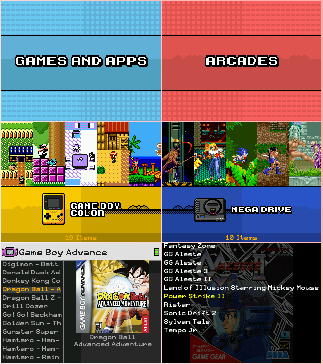

# Retro Pixel BR theme for SimpleMenu

Retro Pixel BR theme for [simplemenu][simplemenu] **(bittboy, pocketgo, powkiddy v90, powkiddy q90)** based on [Retro Pixel BR][retropixelbr] theme for Gmenu2x and [BigCody][bigcody] theme for **simplemenu**.

Tested on [MiyooCFW][miyoocfw]

 

 
Special Thanks to [mrwasterbr][mrwasterbr], [fgl82][fgl82] and everyone who created all the icons and artworks. 

 
 

# Installation

[Download][download] and extract the .zip and place **RetroPixelBR** folder in  
``.simplemenu/themes/320x240`` folder on your sd card.

<!-- Links -->
[retropixelbr]:https://github.com/mrwasterbr/retropixelbr
[bigcody]:https://github.com/fgl82/BigCody
[simplemenu]:https://github.com/fgl82/simplemenu
[miyoocfw]:https://github.com/TriForceX/MiyooCFW
[download]:http://download
[mrwasterbr]:https://github.com/mrwasterbr
[fgl82]:https://github.com/fgl82